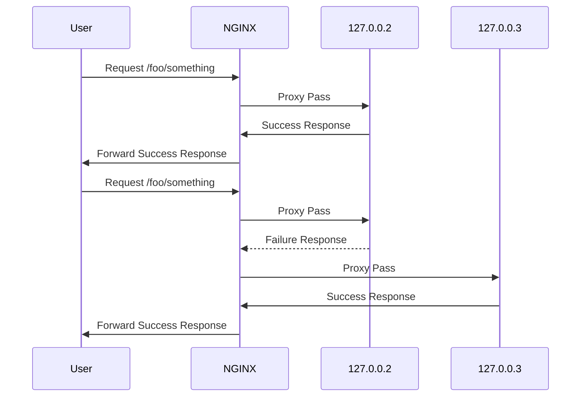

# Dynamic Upstream learning

Just playing with some NGINX lua balancing features

## Motivation

I wanted to learn more about how to balance requests to upstreams in a more dynamic way. What if I need to route some requests to one upstream A, and some other requests to upstream B.

## Problem

You have given the task of balancing requests. If a request with `/foo/something` comes in you need to balance the requests between to server A (primary) and pick the server B (backup) when A does not work.

Ok, it could be a static upstream in NGINX, right? Yes, you are right but rabbits don't come easy.

Servers come and go, and we need to be ready to deliver different hosts for different requests.

